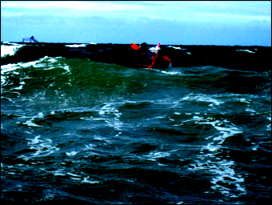

# **Image Captioning using Detection Transformer**

- All methods are implemented and trained from scratch and used for Image captioning

## **Backbones implmented** 

- ResNet feature extractor
- [Detection Transformer (DeTR)](https://arxiv.org/pdf/2005.12872) based encoder decoder
- ViT based decoder

## **Results** 

- See generated_captions folder to see the quality of captions 

## **How to Run - training from scratch** 

```bash
OPENBLAS_NUM_THREADS=1 nohup torchrun \
    --nnodes=1 \
    --nproc_per_node=2 \
    train.py \
    --config configs/res.detr.vit.yaml --dataset coco \
    --epochs 80 --save_every 50 --opt AdamW --grad_clip 1.0 \
    --wd 0.05 --lr 1e-4 --vocab_save_path vocabulary/vocab.coco.detr.pkl \
    --bs 256 --nw 4 --pf 2 --save_path detr.lr1e-4.wd0.05.e80.dist.pth \
    --distributed > logs/detr.lr1e-4.wd0.05.e80.dist.log 2>&1 &
```

## **How to generate caption using pretrained model**

### Using Greedy

```bash
python gen_caption.py --vocab_path vocabulary/vocab.coco.detr.pkl \
    --image_path /data/home/nirbhays/dataset/val2014 \ 
    --model_path saved_models/detr.lr1e-4.wd0.05.e400.dist.pth \
    --config configs/res.detr.vit.yaml --decoding_strategy greedy --num_images 50
```

### Using top_k
```bash 
python gen_caption.py --vocab_path vocabulary/vocab.coco.detr.pkl \
    --image_path /data/home/nirbhays/dataset/val2014 \
    --model_path saved_models/detr.lr1e-4.wd0.05.e400.dist.pth \
    --config configs/res.detr.vit.yaml --decoding_strategy top_k --k 50 --temp 0.7 --num_images 50
```

### Using top_p 

```bash
python gen_caption.py --vocab_path vocabulary/vocab.coco.detr.pkl \
    --image_path /data/home/nirbhays/dataset/val2014 \
    --model_path saved_models/detr.lr1e-4.wd0.05.e400.dist.pth \
    --config configs/res.detr.vit.yaml --decoding_strategy top_p --p 0.95 --temp 0.7 --num_images 50
```

### Using min_p
```bash
python gen_caption.py --vocab_path vocabulary/vocab.coco.detr.pkl \
    --image_path /data/home/nirbhays/dataset/val2014 \
    --model_path saved_models/detr.lr1e-4.wd0.05.e400.dist.pth \
    --config configs/res.detr.vit.yaml --decoding_strategy min_p --p 0.07 --temp 0.7 --num_images 50
```

## **How to test pretrained model using evaluation metrics**

```bash
CUDA_VISIBLE_DEVICES=1 nohup python test.py --config configs/res.detr.vit.yaml \
    --vocab_path vocabulary/vocab.coco.detr.pkl \
    --model_path saved_models/detr.lr1e-4.wd0.05.e400.nocos.dist.pth \
    --decoding_strategy greedy min_p top_k top_p --min_p 0.05 \
    --top_p 0.95 --k 50 --temp 0.7 --bs 32 --nw 2 --pf 1 > logs/test.log 2>&1 &
```

## **Sample Captioning**



- **Greedy**: <SOS> a man sitting at a table with a plate of food <EOS>
- **top_k**: <SOS> a man is sitting at a table with various food dishes <EOS>
- **top_p**: <SOS> a man sitting at a table topped with a plate of food <EOS>
- **min_p**: <SOS> a man in a wheelchair sitting at a table with plates of food <EOS>